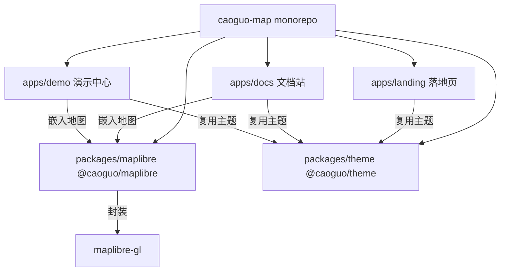

## 用户需求

结合 `docs/prd/` 目录下的 8 份 PRD，输出草果地图（面向六张网的开源可私有化地图引擎）的开发任务。经澄清，本次计划聚焦「纯展示前端优先」：先用 VitePress + Vue3 搭建落地页、文档站、演示中心骨架，最快出可见效果，后续再补引擎与后端能力。

## 产品概述

草果地图是面向地下管网、电网、水网、交通、算力、通信六张网的开源地图引擎 + AI 空间智能服务。本次目标是建立可对外展示的前端三站点（map.hb.cn 落地页、/docs 文档站、/demo 演示中心），统一品牌暗色视觉，复用后续引擎包 `@caoguo/maplibre`。

## 核心功能（本次范围）

- 初始化 pnpm monorepo 脚手架，含 `@caoguo/maplibre` 引擎封装骨架与 `@caoguo/theme` 共享主题包
- 落地页：导航栏、Hero 动态地图背景、痛点区、六张网 Tab、核心能力四宫格、5 行代码示例、数据指标、CTA、Footer，响应式 + SEO
- 文档站：VitePress 骨架 + P0 文档框架（快速开始/安装/API/部署）+ 交互式 MapDemo 组件
- 演示中心：总览页 + 通用布局组件（DemoLayout/SimPanel/CodeViewer）+ Phase 0 四个 Demo（基础地图/GeoJSON/NLPG/Copilot）骨架与武汉模拟数据
- 引擎与 NLPG/GeoAI 后端仅预留目录与接口契约，不实现

## 技术栈选择

- 构建：pnpm workspace + Vite（monorepo）
- 展示框架：VitePress + Vue 3 + TypeScript（落地页/文档站/演示中心统一）
- 地图渲染：maplibre-gl 直接引入；`@caoguo/maplibre` 包仅做轻量 Map 封装与类型导出（引擎核心不实现）
- 共享主题：`@caoguo/theme` 导出 CSS 变量与暗/亮色 token，三站点复用
- 部署：Nginx / Vercel / GitHub Pages（base 路径区分三站点）

## 实现思路

采用 monorepo 单仓多包结构，将「引擎封装」「共享主题」「三站点应用」解耦。展示层优先：地图可视化在引擎就绪前用 `maplibre-gl` 直连（CDN 或本地依赖）保证可见效果，待 `@caoguo/maplibre` 完成后替换 import 源即可，不影响业务代码。三站点通过 `@caoguo/theme` 统一品牌视觉，避免样式重复。演示中心与文档站的交互式地图统一封装为 `MapDemo.vue` 复用。

## 架构设计



## 目录结构

```
caoguo-map/
├── package.json                  # [NEW] 根 package.json，定义 workspace 脚本与依赖
├── pnpm-workspace.yaml           # [NEW] pnpm workspace 配置（packages/*, apps/*）
├── README.md                     # [NEW] 项目说明与启动指引
├── packages/
│   ├── maplibre/                 # [NEW] @caoguo/maplibre 引擎封装骨架
│   │   ├── package.json          # 导出 Map 封装 + 类型，依赖 maplibre-gl
│   │   ├── src/index.ts          # Map 构造函数与类型导出（暂不实现坐标系/Shader/离线）
│   │   └── tsconfig.json
│   └── theme/                    # [NEW] @caoguo/theme 共享主题
│       ├── package.json
│       ├── src/index.ts          # 导出 token 注入函数
│       └── styles/tokens.css     # 暗/亮色 CSS 变量（caoguo-dark / caoguo-light）
└── apps/
    ├── landing/                  # [NEW] 落地页 map.hb.cn
    │   ├── .vitepress/config.ts  # 站点配置 + SEO + 导航
    │   ├── index.md              # 落地页（九大区块，引入自定义 Vue 组件）
    │   ├── components/           # HeroMap.vue / NetworkTabs.vue 等区块组件
    │   └── public/               # og-image 等静态资源
    ├── docs/                     # [NEW] 文档站 map.hb.cn/docs
    │   ├── .vitepress/config.ts  # 侧边栏/导航（guide/api/ai/industry/deployment）
    │   ├── guide/                # 快速开始/安装/核心概念（P0 框架）
    │   ├── api/                  # Map/Layer/Source 参考（P0）
    │   ├── deployment/           # docker / air-gap（P0）
    │   ├── components/MapDemo.vue# 交互式地图嵌入组件（复用 @caoguo/maplibre）
    │   └── index.md
    └── demo/                     # [NEW] 演示中心 map.hb.cn/demo
        ├── .vitepress/config.ts
        ├── index.md              # 演示总览页（六张网卡片网格）
        ├── common/               # DemoLayout.vue / SimPanel.vue / CodeViewer.vue
        ├── basic/ geojson/ nlpg/ copilot/  # Phase0 Demo D1-D4 骨架
        └── data/                 # 武汉背景模拟 GeoJSON（GCJ-02，<1000 要素）
```

## 关键代码结构

```ts
// packages/maplibre/src/index.ts —— 引擎封装契约（骨架）
export interface MapOptions {
  container: string | HTMLElement;
  center?: [number, number];
  zoom?: number;
  style?: string | object;
  pitch?: number;
  bearing?: number;
}
export declare class Map {
  constructor(options: MapOptions);
  addLayer(layer: object): void;
  removeLayer(id: string): void;
  on(event: string, layerId?: string, cb?: (e: any) => void): void;
}
```

## 设计风格

采用「暗色优先 + 科技感」的旗舰级产品官网设计，以 caoguo-dark 深空蓝为基调，玻璃拟态（Glassmorphism）导航栏与卡片，渐变高光与微动效提升质感。落地页 Hero 区嵌入缓慢旋转的武汉夜景动态地图作为视觉锚点，六张网采用 Tab 切换并配卡片网格。整体强调响应式：桌面三/四列网格、平板两列、移动端单列堆叠，移动端导航折叠为汉堡菜单。文档站与演示中心复用同一套暗色主题 token，保证品牌一致性。

## 页面区块（落地页，自上而下）

1. 固定导航栏：毛玻璃背景，滚动渐显，移动端汉堡菜单
2. Hero：品牌标题 + 一句话定位 + 三个 CTA，背景为旋转武汉夜景地图
3. 痛点区：贵 / 锁 / 慢 三列卡片对比
4. 解决方案区：六张网 Tab 切换，每 Tab 配说明 + 截图占位 + CTA
5. 核心能力区：Copilot / NLPG / 离线 / GeoAI 四宫格，含示例文案
6. 代码示例区：5 行代码高亮 + 一键复制 + 旁附渲染效果
7. 数据指标区：开源 / 组件 / 文档 / Demo 计数器动画
8. CTA 区：大标题 + 三个行动按钮
9. Footer：版权 + 链接 + 开源协议声明

## 可用扩展

### Skill

- **Frontend Design**
- 用途：落地页与演示中心需要高质感、非通用 AI 审美的视觉设计，使用此技能生成 Hero 动态地图背景、玻璃拟态区块、微动效与响应式布局
- 预期结果：产出具备旗舰产品气质的落地页视觉与可复用区块组件代码，达到 PRD 的 LCP<1.5s 与 30 秒理解产品目标